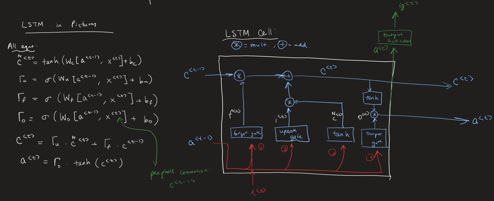

<h1 align= "center">QuantNet</h1>

<p align="center">QuantNet is a Deep Learning framework for quantitative & investment analysis in C++. It uses an implementation of hybrid LSTM and MLP models and a custom data/feature engineering framework for long term time-series investment analysis applications, both built from scratch in C++. QuantNet is built with <b>zero external dependencies</b>, including linear algebra operations, using only the C++ standard library. 
</p>

<div style="text-align: center;">
    
</div>

<br>

## Current Features
- [x] Neural Network Framework (inspired by PyTorch)
  - [x] LSTM Network
    - [x] LSTM Cell Forward & Backward
    - [x] LSTM Forward & Backward
  - [x] MLP Forward & Backward
  - [x] Adam Optimizer
     
- [x] Data Engineering Framework
    - [x] Transforms original stock data to stock features that are commonly used in investment analysis    

- [x] Linear Algebra Framework
  - [x] Made from scratch with functionalities inspired by NumPy
     
- [x] Activation Functions
  - [x] ReLU
  - [x] Sigmoid
  - [x] tanh
  - [x] Linear
     
<br>
⚠ <b>DISCLAIMER</b>: This project is still IN-PROGRESS and is still in an Alpha testing phase. I am currently working on debugging and testing the framework and it is not ready to be implemented by users yet.

<br>
<br>

Sample implementation (from `src/train_model.cpp`)
```cpp
#include "model/linalg.h"
#include "model/HybridModel.h"
#include "framework/DataFramework.h"
#include <vector>
#include <iostream>

int main() {
    // Generate sample data
    const int batch_size = 64;
    const int numUnits = 64;
    const auto [X_train, Y_train] = DataFramework::preprocessDataFromFile("<absolute_path_to_data>.csv");

    // Init neural network layers and dimensions
    const std::vector<std::string> layer_types = {"LSTM", "LSTM", "Relu", "Relu", "Linear"};
    const std::vector<int> layer_dims = {static_cast<int>(X_train[0][0].size()), 64, 64, 32, 1};

    //Init data and parameters for HybridModel
    HybridModel::init_data(X_train, Y_train, batch_size);
    HybridModel::init_hidden_units(numUnits);

    // Initialize the layers
    HybridModel::init_layers(layer_types, layer_dims);

    // Initialize the network parameters
    HybridModel::initialize_network();

    // Initialize the learning rate
    HybridModel::init_learning_rate(3e-4);

    // Initialize Adam optimizer
    HybridModel::init_Adam();

    // Initialize training values
    const int epochs = 1000;
    int seed = 10;

    for (int i = 0; i < epochs; i++) {
        // Generate minibatches
        seed++;
        auto minibatches = HybridModel::generate_minibatches(X_train, Y_train, batch_size, seed);

        // Model iteration through minibatches
        for (const auto& batch : minibatches) {
            auto& X_batch = std::get<0>(batch);
            auto& Y_batch = std::get<1>(batch); 

            // Forward prop
            HybridModel::forward_prop(X_batch);
            std::cout << "Forward prop done" << std::endl;

            // Compute loss
            HybridModel::loss(Y_batch);
            std::cout << "Loss computed" << std::endl;

            // Backward prop
            HybridModel::back_prop();
            std::cout << "Backprop done" << std::endl;

            // Optimize
            HybridModel::optimize();
            std::cout << "Optimizing done" << std::endl;
        }

        std::cout << "Average training loss: " << HybridModel::return_avg_loss() << std::endl;
    }

    return 0;
}

```
<br>

### Citations:
1) [Original LSTM Paper for LSTM model implementation](https://deeplearning.cs.cmu.edu/S23/document/readings/LSTM.pdf)
2) [Feature engineering for the data framework](https://medium.com/aimonks/improving-stock-price-forecasting-by-feature-engineering-8a5d0be2be96)
